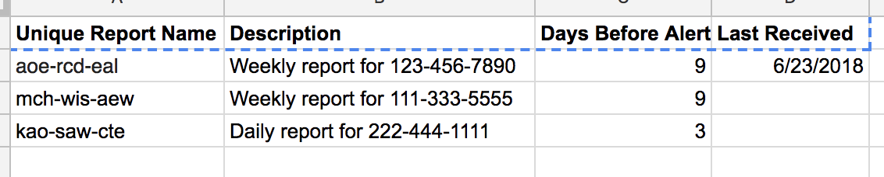

# auction-insights-automation 

## Overview

This [Apps Script](https://developers.google.com/apps-script/) solution demonstrates an approach taken to automating the downloading and processing of [Auction Insights](https://support.google.com/adwords/answer/2579754) reports.

## Account setup

It is necessary to set up a Google account specifically for use with this script.

1.  Open [Gmail](https://www.gmail.com/) and create a new account.
1.  Within your existing AdWords account, grant access to this newly-created Google account:
    1.  Navigate to **Setup > Account Access** and under **Users** click **+**.
    1.  In the dialog titled **Invite others to access this account**, for **Access level** select **Email only**.
    1.  Enter the email address for the newly-created Google account, and click **Send invitation**.
    1.  Within the newly-created Google account, accept the invite that will arrive in the Gmail inbox.
    
> NOTE: This account setup detail is critical: This solution depends on scheduled Auction Insights reports by email, where
> each email contains a download link which can be automatically followed. Only by choosing **Email only** will the report
> emails be of this format: **Email only** cannot assume that the recipient will have an AdWords account, therefore the emails
> contain a download link. The other, greater, levels of access do not contain such a link, and instead contain a link to an
> Adwords login flow for generating a report. This flow cannot be used by this type of solution.

## Schedule Auction Insights reports in AdWords

Follow AdWords guidance to create and schedule Auction Insights reports:

1.  Click the download icon and select **schedule**.
1.  Set the following options:
    1.  Change the recipient to the newly-created Google-account.
    1.  Select the frequency option, e.g. **daily**.
    1.  Select **csv** for the format (not Excel csv).
    1.  Check **compress file**.
    1.  Give the report a unique name, for the *Save the report* placeholder.
1.  Click **schedule** to create the new report schedule.

## Create a configuration spreadsheet

A Google Sheets document is used as a configuration file, detailing which reports to expect by email, and how often.

An example is shown below:

The columns must be as follows:

*   **Unique Report Name** Enter the report name as created in the Auction Insights schedule.
*   **Description** Enter a meaningful description - this is purely to aid administration.
*   **Days Before Alert** Enter the number of days since the last report was received, after which to raise an alert. For
    example, for a weekly report, 8 or 9 days might be a good value, for a daily report, 2 or 3.
*   **Last Received** Enter today's date (to avoid getting an alert the first time the script runs).

## Create and schedule the Apps Script project

> An Apps Script script runs regularly on a schedule to perform the following actions:
>
> 1.  Examine all emails in the Google-account
>     1.  For those that are Auction Insights reports, extract and follow the download link, saving the data to Drive. Once
>         successful, these messages are deleted.
>     1.  For unexpected emails, marking them with a star (to avoid reprocessing), and sending an alert.
> 1.  Check the dates of all expected reports. Where any are overdue, send an email alert.
>
> The script also attempts to be mindful of changes to the email report delivery format and will send alerts where:
>
> *   The subject is not as expected.
> *   The email does not contain the expected download link format.
> *   An error results in trying to download the report.

1.  Using the newly-created Google account, [create a new script](https://script.google.com).
1.  Paste in the contents from [ai.js](https://github.com/plemont/auction-insights-automation/blob/master/ai.js).
1.  Complete the values for **EMAIL_RECIPIENT**, **OUTPUT_FOLDER_ID** and **REPORT_MAP_SPREADSHEET_URL**.
1.  Within the script, schedule execution for as often as possible, ideally at least daily: **Edit > Current project's triggers**.

## Extending the solution

Having created and scheduled the script, reports will now regularly be saved to Drive. This should work well even for
Auction Insights reports being generated across 10 or 12 accounts.

However, the writing to Drive is meant purely as an example, and the code should be easily extendable to onward process the
data, write it to a database and so on.
